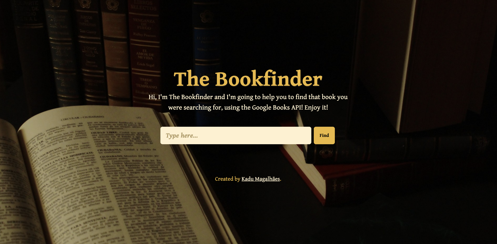

# The Book Finder

The Book Finder is an application that allows users to search for books by using the Google Books API.

## My Goals:
- [x] Understanding CSS3 Flexbox;
- [x] Controling DOM;
- [x] Using pure JavaScript;
- [x] Implementing the Google Books API to show the search results;

**You can see the live demo on [The Book Finder Demo](https://the-book-finder.vercel.app/).**
